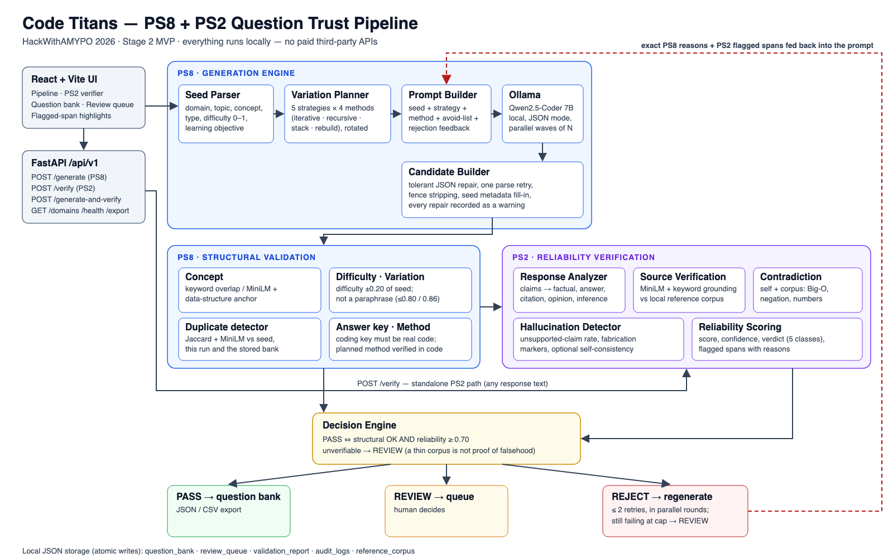

# Code Titans — PS8 + PS2 Question Trust Pipeline

**HackWithAMYPO 2026 · Stage 2 MVP · Team Code Titans (Ashadavid S J, Dinesh A)**

One seed question in, many **distinct, verified** question variations out. Each variation ships
with an answer key and a trust verdict. Two problem statements work together as two gates:

- **PS8 — Question Variation Generation.** Parses the seed, plans variations across 5 framing
  strategies × 4 solution methods, generates them with a local LLM, and validates each one
  structurally.
- **PS2 — Hallucination Detection & Reliability Scoring.** Splits each response into claims,
  grounds them against a local reference corpus, detects contradictions and fabrication
  markers, and returns a reliability score, a verdict and flagged spans with reasons.

Everything runs locally: **Ollama + Qwen2.5-Coder 7B** for generation and
**all-MiniLM-L6-v2** for embeddings. No paid third-party APIs are used anywhere.



---

## Measured results

All numbers below come from real runs on an Apple M5 laptop (16 GB) with Qwen2.5-Coder 7B, not
from estimates. Seed: *"Write a function to reverse a singly linked list."*

| Run | Accepted | Duplicate rate | Time |
|---|---|---|---|
| `/generate` count=15, AC power, 4 parallel slots | **14 / 15** | 0.0 | 370 s |
| `/verify` on a hallucinated response | 6 flagged spans, verdict `misleading` | — | 214 ms |

- Accepted variations use **four verified solution methods**: iterative, recursive,
  auxiliary stack, and non-destructive rebuild. Each method is checked in the answer-key code,
  not taken on the model's word.
- Every accepted coding variation has a **real code answer key**. Prose descriptions of a
  solution are rejected.
- **PS8 Stage 3 target not met yet:** 60 variations in under 5 minutes. See
  [Known limitations](#known-limitations).
- **PS2 accuracy has not been measured against a labelled benchmark yet**, so no
  precision or recall figure is claimed.

---

## Quick start (local — recommended)

**Requirements:** Python **3.12** (3.14 has no `pydantic-core` wheels yet), Node 20+,
[Ollama](https://ollama.com).

```bash
# 1. Model runtime - 4 parallel slots roughly doubles generation throughput
ollama pull qwen2.5-coder:7b
OLLAMA_NUM_PARALLEL=4 ollama serve          # leave this running

# 2. Backend
python3.12 -m venv .venv
.venv/bin/pip install -r requirements.txt
AMYPO_GENERATION_CONCURRENCY=4 .venv/bin/python -m uvicorn backend.app.main:app --port 8000
#   API docs:  http://localhost:8000/docs
#   Health:    http://localhost:8000/api/v1/health   -> "status": "ok"

# 3. Frontend
cd frontend && npm install && npm run dev   # http://localhost:5173
```

Keep `AMYPO_GENERATION_CONCURRENCY` at or below Ollama's `OLLAMA_NUM_PARALLEL`. If Ollama runs
without it, leave concurrency at the default of 1. Otherwise Ollama just queues the requests
and there is no speed-up.

Long generations take minutes. On a laptop, stay on AC power, turn Low Power Mode off, and
keep the machine awake (`caffeinate -i` on macOS). A sleeping Mac pauses Ollama mid-request.

## Docker

```bash
OLLAMA_NUM_PARALLEL=4 ollama serve          # on the host, model pulled as above
AMYPO_GENERATION_CONCURRENCY=4 docker compose up --build
#   UI:  http://localhost:5173     API: http://localhost:8000/docs
```

Ollama deliberately runs **on the host**, not in a container. Running a 7B model under Docker on
macOS loses GPU (Metal) acceleration. The backend reaches it at `host.docker.internal:11434`.

> **Untested:** the Dockerfiles have been written but not yet built. Docker was not installed on
> the development machine. The local quick start above is the verified path.

---

## API

The full spec is in [`openapi.yaml`](openapi.yaml), generated from the code with
`.venv/bin/python scripts/export_openapi.py`. It is also served live at `/docs`.

| Method | Path | Purpose |
|---|---|---|
| POST | `/api/v1/generate` | **PS8 contract.** Seed + domain + count (≤ 60) → variations with answer keys |
| POST | `/api/v1/verify` | **PS2 contract.** Any response text → reliability score, verdict, flagged spans |
| POST | `/api/v1/generate-and-verify` | Integrated pipeline: both gates, a decision, and regeneration |
| GET | `/api/v1/domains` | 7 supported domains |
| GET | `/api/v1/health` | Ollama, embedding model, corpus and config status |
| GET | `/api/v1/questions` · `/review-queue` · `/validation-reports` · `/audit-logs` | Stored results |
| GET | `/api/v1/export?fmt=json\|csv` | Question-bank export |

```bash
curl -X POST localhost:8000/api/v1/generate -H 'Content-Type: application/json' \
  -d '{"seed_question": "Write a function to reverse a singly linked list.",
       "domain": "programming", "count": 15}'

curl -X POST localhost:8000/api/v1/verify -H 'Content-Type: application/json' \
  -d '{"response_text": "Recursive linked list reversal always uses O(1) space."}'
```

The response fields required by the PS8 and PS2 contracts are returned exactly as specified.
Extra fields, such as `solution_method`, `structural_validation`, `rejected`, `timings_ms` and
`warnings`, are additive.

---

## How it works

1. **Seed parser.** Extracts domain, topic, core concept, question type, difficulty (a 0–1
   score) and learning objective. It works heuristically, and Qwen optionally refines it one
   field at a time.
2. **Variation planner.** Rotates **5 strategies** (scenario, parameter, constraint, structure,
   representation) and, for coding seeds, **4 solution methods**. Because 5 and 4 are coprime,
   20 variations cover every strategy × method pair once.
3. **Generation.** Qwen via Ollama in JSON mode, sent in parallel waves. Later waves are told
   what earlier waves produced, so they don't repeat it.
4. **Candidate builder.** Recovers JSON from malformed or truncated output, retries once when
   output cannot be parsed, strips code fences, and records every repair as a warning.
5. **PS8 structural validation.**
   - **Concept preserved:** checked with keyword overlap or MiniLM similarity, plus a
     data-structure anchor, so a linked-list seed cannot drift to arrays.
   - **Difficulty:** within ±0.20 of the seed.
   - **Not a duplicate:** of the seed, of this run, or of the stored bank.
   - **Not a paraphrase:** similarity to the seed ≤ 0.80, or ≤ 0.86 when the solution method
     verifiably changes.
   - **Answer key:** a coding question's key must be real code.
   - **Method:** the planned method is verified in the answer-key code.
6. **PS2 verification.** Claims are labelled factual, answer, citation, assumption, opinion or
   inference, and only the first three must be grounded. Grounding uses MiniLM similarity *and*
   keyword overlap. Contradiction detection covers Big-O mismatches, negation and numeric
   conflicts. Fabrication markers cover invented citations and suspiciously precise
   statistics. The output is a weighted reliability score, one of 5 verdicts, and flagged spans.
7. **Decision and regeneration.** A variation passes only if both gates pass. A rejected one is
   regenerated with its **exact rejection reasons** in the prompt, up to 2 times, in parallel
   rounds. A claim that cannot be verified routes to REVIEW, never to REJECT.

Every threshold lives in [`backend/app/config.py`](backend/app/config.py), and any of them can
be overridden with an `AMYPO_*` environment variable. See [`.env.example`](.env.example).

---

## Tests

```bash
.venv/bin/python -m pytest        # 173 tests, ~10 s, no model needed (generation is faked)
```

Validation tests use the real MiniLM model. Several regression tests are built from real Qwen
outputs that exposed bugs: prose answer keys, "rebuild" answers that actually rewired the input
in place, and a linked-list seed that drifted to arrays.

---

## Known limitations

- **Speed.** About 11 s per variation on first attempt with 4 parallel slots on an M5 laptop, so
  60 variations take well over 5 minutes, before counting retries. The PS8 Stage 3 target of
  60 variations in under 5 minutes needs faster hardware or a smaller model.
- **Solution methods exist for coding questions only.** Other domains vary by framing strategy
  alone.
- **The reference corpus is small (36 entries).** It is strong for programming and thin
  elsewhere, so many correct non-programming claims come back as `unverifiable` and go to
  REVIEW.
- **Hallucination detection is heuristic**, an explainable signals-based proxy rather than a
  trained classifier. It has not been measured against a labelled benchmark yet.
- **Difficulty** is estimated from linguistic and structural cues, not learned from human
  ratings.
- **Cold start.** The first MiniLM load takes up to about 20 s. The server warms it in the
  background at startup.
- **Answer-key correctness** is checked for form (real code, correct method) but the code is not
  executed against the test cases.

---

## Project layout

```
backend/app/
  api/          FastAPI routes (PS8, PS2, pipeline, storage, health)
  ps8/          seed parser, strategies, methods, planner, prompt builder,
                generation engine, candidate builder, validation/
  ps2/          response analyzer, source verification, contradiction,
                hallucination detector, reliability scoring
  decision/     PASS / REVIEW / REJECT engine
  core/         Ollama client, embeddings, storage, timing
  config.py     every threshold and setting (AMYPO_* env overrides)
backend/tests/  pytest suite
frontend/       React + Vite UI
data/           reference corpus, demo fixtures, JSON stores
docs/           architecture diagram, model card, one-page summary
openapi.yaml    generated API spec
```
